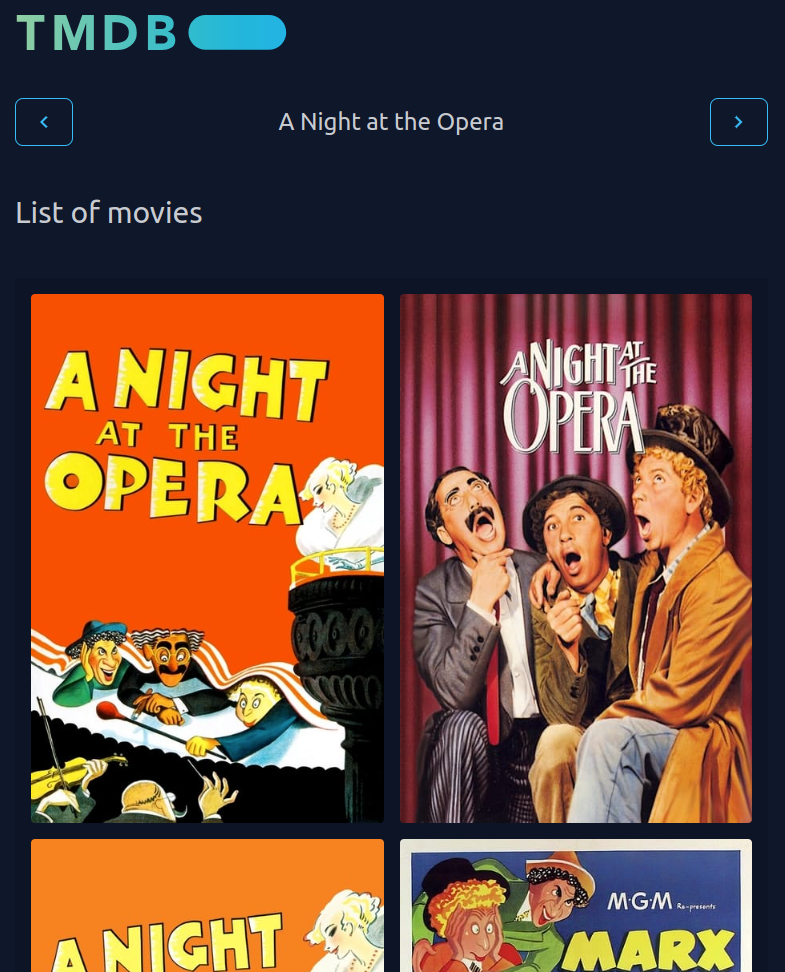

# Nautilus Movie Thumbnailer

This scripts allow to generate thumbnails for video files related to movies.

It uses iMDb to get search for the title and get the poster of the movie.

## Scripts

There are 2 scripts:

- `several-movies.php`: it loads the first movie found depending on the file name.
- `single-movie.php`: it searchs for the title in iMDb, then list 10 results and after selecting the match, it loads the poster. In case the film is not listed, it allows the user to search for it manually.
- `refresh-video.php`: refresh local videos thumbs using `ffmpeg`, it works with samba files too.
- `themoviedb-selector`: electron app that allows to select the movie poster from TMDB

## Install

- Download or clone this repository
- Set both scripts as executable

```bash
chmod +x several-movies.php
chmod +x single-movie.php
```

- Go to this folder in your `$HOME`
```bash
cd ~/.local/share/nautilus/scripts
```
- Create 2 scripts in that folder, one for each script:

`several-movies`
```bash
#!/bin/bash

gnome-terminal -- "/[full-path-to-the-project]/nautilus-movie-thumbnailer/several-movies.php"
```

`single-movie`
```bash
#!/bin/bash

gnome-terminal -- "/[full-path-to-the-project]/nautilus-movie-thumbnailer/single-movie.php"
```

- Set the scripts as executable:
```bash
chmod +x several-movies
chmod +x single-movie
```

## themoviedb-selector

 

### Install

`yarn install`

### Run

`npm run start -- -- '[path to the file]'`

### Build

```bash
npm run make
sudo apt install ./themoviedb-selector/out/make/deb/x64/themoviedb-selector_1.0.0_amd64.deb
```

### Integrate with Nautilus

Create a script in Nautilus script folder with the following content:
```sh
#!/bin/bash

selected_uris=$NAUTILUS_SCRIPT_SELECTED_URIS
uris_with_pipes=$(echo "$selected_uris" | tr '\n' '|')
uris_with_pipes=$(echo "$uris_with_pipes" | sed 's/|$//')
themoviedb-selector -- "$uris_with_pipes"
```
